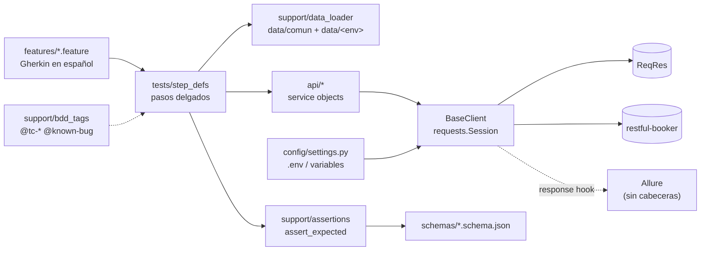

# Test-Backend-Cod

[](https://github.com/DannyDan2016/Test-Backend-Cod/actions/workflows/api-tests.yml)
[](https://dannydan2016.github.io/Test-Backend-Cod/)
[](LICENSE)


Suite de automatización de pruebas de API sobre dos APIs públicas, **ReqRes** y **restful-booker**. Usa BDD en español, service objects, datos y valores esperados en YAML por ambiente, contratos JSON Schema, ejecución en Docker y CI con un reporte Allure publicado en GitHub Pages.

Es una muestra curada: 17 escenarios (22 casos con los ejemplos de los esquemas) elegidos por riesgo y por técnica sobre un inventario de unos 124 casos posibles. El criterio y la trazabilidad están en [docs/estrategia-de-pruebas.md](docs/estrategia-de-pruebas.md).

## Qué demuestra

- **Contratos** con JSON Schema (draft 2020-12) derivados de la OpenAPI 2.1.0 de ReqRes.
- **Casos positivos, negativos y de borde**: paginación, 404, JSON malformado, api key inválida, datos obligatorios y usuarios no permitidos.
- **Rendimiento** acotado: respuesta con retardo dentro del umbral definido en el YAML de cada ambiente.
- **Flujo E2E con persistencia real** en restful-booker: crear, leer, actualizar con token, borrar y verificar el 404. Cada escenario crea y limpia sus propios datos.
- **Bugs reales documentados** como `xfail(strict=True)`: verifican el comportamiento correcto y, si un día se corrigen, avisan.
- **Calidad del framework**: tests unitarios sin red del cargador de datos, del helper de aserción y de la traducción de tags, más la validación estática de todos los YAML y contratos.

## Stack

| Pieza | Versión | Uso |
|---|---|---|
| Python | 3.12 | Lenguaje |
| pytest | 9.1.1 | Runner |
| pytest-bdd | 9.0.0 | Gherkin en español (`# language: es`) |
| requests | 2.34.2 | Cliente HTTP |
| jsonschema | 4.26.0 | Contratos |
| PyYAML | 6.0.3 | Datos y esperados por ambiente |
| allure-pytest-bdd | 2.16.2 | Resultados para Allure 3 |
| ruff | 0.16.9 | Lint y formato |
| Docker / Compose | python:3.12-slim, node:24-slim | Ejecución reproducible y generación del reporte |

## Arquitectura



- **Los pasos no contienen URLs ni valores de negocio.** Cargan un caso del YAML, delegan la llamada en un service object y verifican con `assert_expected`, que compara la respuesta con el bloque `expected` del caso y acumula todas las diferencias en un único error.
- **Los service objects** (el equivalente al POM en API) exponen una operación por endpoint y devuelven la `Response` sin hacer aserciones.

## Estructura

```
Test-Backend-Cod/
├── api/                      # service objects
│   ├── base_client.py        # transporte: Session, timeout, x-api-key
│   ├── reqres/               # ReqResClient, UsersService, AuthService
│   └── booker/               # BookerClient, HealthService, AuthService, BookingService
├── config/settings.py        # ambientes (prod, staging) y variables de .env
├── data/
│   ├── comun/                # datos y esperados comunes (+ bugs_conocidos.yaml)
│   ├── prod/                 # overrides de prod (vacío: hereda de comun)
│   └── staging/              # overrides de ejemplo (umbrales de tiempo)
├── features/                 # Gherkin: reqres/{usuarios,autenticacion,robustez}, booker/reservas
├── schemas/                  # contratos JSON Schema (reqres/, booker/)
├── support/                  # data_loader, assertions, schemas, bdd_tags, api_key_policy, allure_http
├── tests/
│   ├── step_defs/            # pasos por feature (+ conftest con pasos y fixtures comunes)
│   └── unit/                 # tests del framework, sin red
├── docs/estrategia-de-pruebas.md
├── .github/                  # workflow, dependabot y plantilla de PR
├── Dockerfile                # etapas base, lint y runtime
└── docker-compose.yml        # servicios api-tests, lint y allure
```

## Ejecución local

Requisitos: Python 3.12 y una API key gratuita de [app.reqres.in](https://app.reqres.in) (cabecera `x-api-key`).

```bash
git clone https://github.com/DannyDan2016/Test-Backend-Cod.git
cd Test-Backend-Cod
python -m venv .venv
source .venv/bin/activate          # Windows (PowerShell): .venv\Scripts\Activate.ps1
pip install -r requirements-dev.txt
cp .env.example .env               # edita .env y define REQRES_API_KEY
```

```bash
ruff check . && ruff format --check .   # lint
pytest                                  # suite completa
pytest -m smoke                         # casos críticos
pytest -m unit                          # solo el framework, sin red
pytest -m "regression and not known_bug"
pytest -m known_bug -rx                 # bugs documentados y su motivo
pytest --env staging -m smoke           # otro ambiente
```

Sin `REQRES_API_KEY`, los escenarios de ReqRes (`@requiere_key`) se omiten con un motivo que explica cómo configurarla. Los de restful-booker no necesitan key.

## Ejecución en Docker

```bash
mkdir -p reports
docker compose build
docker compose run --rm api-tests                 # suite completa
docker compose run --rm api-tests -m smoke        # argumentos extra para pytest
docker compose run --rm lint                      # ruff dentro de la imagen
docker compose --profile report run --rm allure   # genera reports/allure-report
```

El `.env` se inyecta en tiempo de ejecución y nunca entra en la imagen. En Linux, para que `./reports` pertenezca a tu usuario, exporta `HOST_UID=$(id -u) HOST_GID=$(id -g)` antes de `build` y de `allure`.

Para abrir el reporte, sírvelo por HTTP, por ejemplo con `npx allure@3.19.1 open reports/allure-report`.

## CI (GitHub Actions)

[`.github/workflows/api-tests.yml`](.github/workflows/api-tests.yml) ejecuta todo **dentro de la imagen Docker** con docker compose:

| Evento | Selección |
|---|---|
| push a `main` y pull requests | lint + `-m "smoke or unit"` |
| cron nocturno (05:00 UTC) | suite completa |
| `workflow_dispatch` | expresión `-m` y ambiente a elegir |

- La key llega desde el secret `REQRES_API_KEY`. Si falta, la sesión **falla** (código 4), salvo en PRs desde forks o de Dependabot, que no reciben secrets: ahí se omiten los `@requiere_key`.
- Cada ejecución publica un resumen JUnit en el job y sube los artefactos. Desde `main`, el reporte Allure 3 se publica en GitHub Pages.
- Dependabot mantiene al día pip, las actions y la imagen base.

## Multiambiente

- **Ambiente:** `pytest --env <ambiente>` o la variable `TEST_ENV`. Los ambientes disponibles son `prod` y `staging`; `staging` es un ejemplo que apunta a las mismas URLs públicas.
- **URLs y timeout:** se definen por ambiente en `config/settings.py` y se pueden sobrescribir desde `.env` o con variables del sistema (ver [.env.example](.env.example)).
- **Datos:** `data/comun/**` se combina con `data/<env>/**` mediante un merge profundo en el que gana el ambiente. Si una clave no existe, el error indica el tramo que falta, los archivos consultados y las claves disponibles.

## Tags

| Tag | Significado |
|---|---|
| `@smoke` / `@regression` | Prioridad: críticos y rápidos / resto de la regresión |
| `@negative` | Caso negativo |
| `@contrato` / `@rendimiento` / `@seguridad` | Técnica principal |
| `@requiere_key` | Necesita `REQRES_API_KEY` |
| `@tc-api-NNN` | ID del inventario. Se convierte en el marcador `tc` y en el ID de Allure |
| `@known-bug @bug:<ID>` | Bug real del sistema bajo prueba: `xfail(strict=True)` con el motivo de `data/comun/bugs_conocidos.yaml` |
| `@reqres` `@booker` `@usuarios` `@autenticacion` `@robustez` `@reservas` | Área |

`--strict-markers` está activo. Los tags especiales se traducen en `support/bdd_tags.py` mediante el hook `pytest_bdd_apply_tag`.

## Reporte

Cada paso del reporte Allure lleva adjunta su petición y su respuesta: método, URL, status, tiempo y cuerpos. **Nunca se adjuntan las cabeceras de la petición**, para que la `x-api-key` no llegue al reporte publicado. Los casos llevan su ID `TC-API-NNN`, la feature y los tags.

## Bugs encontrados

| ID | API | Esperado | Observado |
|---|---|---|---|
| DEV-004 | ReqRes `POST /api/login` con password incorrecta | 400/401 | 200 con token |
| BKR-BUG-6 | restful-booker `POST /booking` | 201 | 200 |
| BKR-BUG-3 | restful-booker `DELETE /booking/{id}` | 200/204 | 201 |

La evidencia, el resto de desviaciones (p. ej. DEV-001, un 404 con cuerpo `{}`) y los bugs inventariados que no se automatizaron están en la [estrategia de pruebas](docs/estrategia-de-pruebas.md#5-bugs-y-desviaciones-encontrados).

## Limitaciones conocidas

- **APIs de terceros.** ReqRes limita las peticiones por key (250 al día en el plan observado) y restful-booker es un playground compartido en Heroku, que puede tardar en arrancar o caerse. Si `/ping` no responde, los escenarios de booker se omiten con el motivo.
- **Reporte Allure.** Allure muestra los `xfail` como *skipped*, y `allure-pytest-bdd` solo reporta los escenarios BDD: los tests unitarios aparecen en la consola y en el JUnit, pero no en Allure.
- **Tags en `Ejemplos`.** En pytest-bdd 9, los tags de un bloque `Ejemplos` no pasan por `pytest_bdd_apply_tag`, así que ahí solo se usan marcadores registrados (`@smoke`, `@regression`, `@negative`). Los `@tc-*` van en el escenario.
- **Ambiente staging.** Es ilustrativo: las APIs públicas no tienen staging.

## Contribuir

Ver [CONTRIBUTING.md](CONTRIBUTING.md).

## Autor

**Danny Parrado**: QA Automation Engineer. [GitHub](https://github.com/DannyDan2016)

Licencia [MIT](LICENSE).
